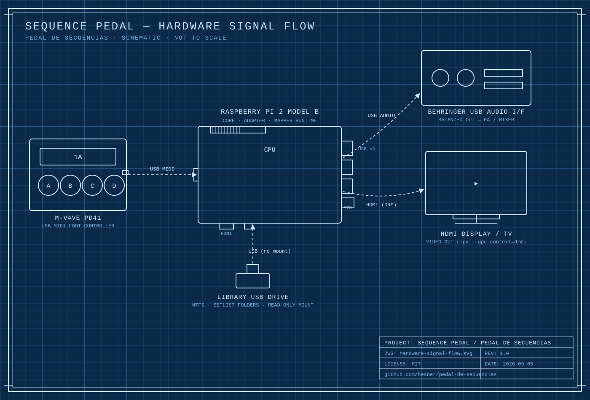

# Chocolate Pi

*[Read in English](../../README.md)*

[](https://github.com/hesner/chocolatepi/actions/workflows/tests.yml)
[](../../LICENSE)



Un controlador de pedalera MIDI basado en Raspberry Pi para disparar
audio y video en vivo sobre el escenario. Construido para la banda
**NO FUTURO**, diseñado para funcionar con cualquier controlador MIDI
estándar — no atado a una marca específica de pedal.

Presionas un footswitch, suena una canción o un clip de video. Presionas
otro, se detiene y empieza el siguiente. Un STOP dedicado siempre está a
una pulsación de distancia, al instante, sin importar qué esté sonando.
Cuando no hay nada seleccionado, un video de standby queda en loop en
pantalla. No hace falta pantalla ni teclado una vez configurado — se
conecta la energía y queda listo.

## Por qué existe

La mayoría de los montajes "pedalera MIDI → disparar pistas de
acompañamiento" o bien atan a la banda a una marca específica de pedal, o
requieren una laptop en el escenario. Este proyecto es, en cambio, un
pequeño aparato dedicado: una Raspberry Pi que arranca directo en modo
show, lee mensajes MIDI Program Change estándar desde cualquier
controlador que esté conectado, y reproduce lo que esté mapeado a cada
botón — canciones de solo audio (MP3/WAV) o clips de video completos con
audio embebido (MP4/MOV/MPEG).

## Cómo está construido

Cuatro capas independientes, para que las partes que conocen un
controlador MIDI específico nunca se filtren a las partes que conocen la
reproducción:

```
CONTROLADOR MIDI  →  Adapter  →  Mapper  →  Core
  (cualquier marca)   (específico   (MIDI →     (reproducción de
                       del disp.)    acciones     audio/video,
                                     abstractas)  biblioteca, standby)
```

- **Adapter** (`src/adapter/`) — la única capa autorizada a conocer las
  particularidades de un controlador específico. Actualmente validado
  contra un M-VAVE PD41; cambiar de controlador solo toca esta capa.
- **Mapper** (`src/mapper/`) — traduce Program Change MIDI estándar a
  acciones abstractas (`SelectTrack`, `Stop`). Funciona con cualquier
  controlador que mande Program Change estándar, sin importar la marca.
- **Core** (`src/core/`) — controla la reproducción real: resuelve una
  selección contra una biblioteca en un USB, maneja `mpv` para video (con
  un loop de standby y un carril de audio dedicado para pistas de solo
  audio), y siempre le da prioridad al audio sobre el video si alguna vez
  hay que elegir entre los dos.

El razonamiento completo de la arquitectura, cada decisión aprobada, y la
evidencia detrás de cada una viven en
[`MASTER_SPECIFICATION.md`](../../MASTER_SPECIFICATION.md) — el contrato
real del proyecto, no solo un resumen.

## Estado

En uso activo y probado contra hardware real: una Raspberry Pi 2, una
interfaz de audio USB Behringer U-PHORIA UM2, un controlador MIDI
M-VAVE PD41, y un USB de biblioteca. Ver [`TESTING.md`](../../TESTING.md) para lo ya
validado (sincronía audio/video, timing real de video en TV, seguridad
ante cortes de energía) y [`MAVAVE_ANALYSIS.md`](../../MAVAVE_ANALYSIS.md)
para el análisis empírico del controlador MIDI detrás del mapeo actual.

## Para empezar

Hardware: una Raspberry Pi (desarrollado contra una Pi 2, Raspberry Pi OS
Lite), una interfaz de audio USB, un controlador MIDI de pedalera que
pueda mandar Program Change estándar, y un USB para la biblioteca de
canciones/videos.

Software: `python3` (solo librería estándar — sin paquetes de Python de
terceros, nada que instalar con `pip`), más `mpv`, `ffmpeg` y `ntfs-3g`
en la propia Pi (`sudo apt install -y mpv ffmpeg ntfs-3g`).

```
git clone https://github.com/hesner/chocolatepi
cd chocolatepi
python3 -m unittest discover -s tests -v   # esta parte no necesita hardware
```

La instalación completa paso a paso —USB de biblioteca, servicio de
`systemd` para arranque automático, y sistema de archivos raíz de solo
lectura— está en [`systemd/README.md`](systemd/README.md), desde
los prerequisitos hasta un aparato completamente blindado. Una vez esté
corriendo, revisa [`LIBRARY.md`](LIBRARY.md) antes de organizar
canciones/videos en el USB de biblioteca — un error de nombre de archivo
fácil de cometer ahí falla completamente en silencio.

## Estructura del proyecto

```
src/
├── adapter/            Traducción específica del controlador MIDI
├── mapper/             MIDI estándar → acciones abstractas
├── core/               Reproducción, biblioteca, standby
├── main.py             Punto de entrada real del runtime
├── live_test.py        Prueba manual de hardware: imprime qué haría el
│                       Adapter/Mapper con cada mensaje MIDI, sin tocar la reproducción
└── core_smoke_test.py  Prueba manual de hardware: ejercita Player/AudioPlayer
                        directamente (video+audio, standby), sin la capa MIDI

tests/          Tests unitarios (no requieren hardware)
systemd/        Servicio de arranque automático, notas de udev/fstab
scripts/        Scripts de configuración puntuales (ej. el video de standby de respaldo)
docs/es/        Traducciones al español de la documentación del proyecto
```

## Contribuir

Issues y pull requests son bienvenidos — ver [`CONTRIBUTING.md`](CONTRIBUTING.md)
para los lineamientos, y [`CHANGELOG.md`](CHANGELOG.md) para el historial
de cambios. Si estás adaptando esto para un controlador MIDI distinto, la
capa `Adapter` (`src/adapter/`) es donde va ese trabajo — el `Mapper` y
el `Core` no deberían necesitar cambios.

## Apoya este proyecto

Si este proyecto te resulta útil, considera
[apoyarlo por GitHub Sponsors](https://github.com/sponsors/hesner).

## Licencia

[MIT](../../LICENSE) — úsalo, modifícalo, véndelo comercialmente, sin
condiciones.

## Créditos

Arquitectura, especificación, y validación de hardware por Hesner Duran
para **NO FUTURO**. Implementación construida con
[Claude Code](https://claude.com/claude-code).
